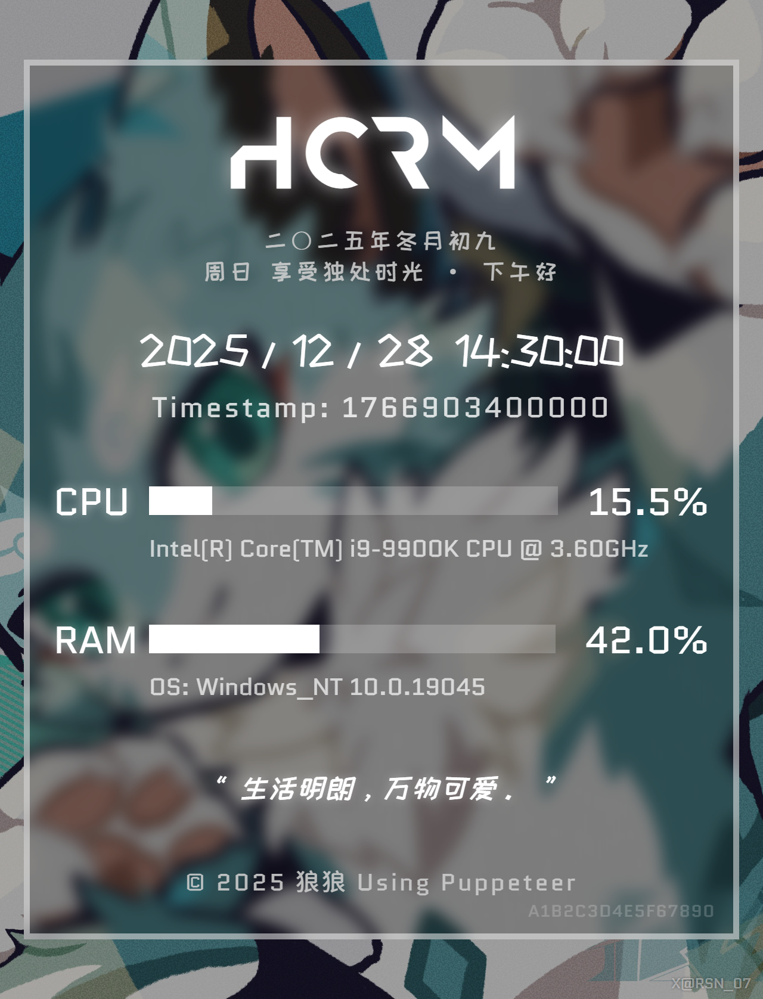

# koishi-plugin-mk3s-hcrm

一个用于 Koishi 的系统状态卡片生成插件。支持生成包含 CPU/RAM 使用率、时间、农历、一言等信息的精美卡片。

<div align="center">
  
</div>

## ✨ 功能特性

- **双渲染引擎支持**：
  -  **Puppeteer**：基于浏览器渲染，支持高级 CSS 特性（如毛玻璃特效）。
  -  **Satori**：基于 React 组件转 SVG，速度极快，资源占用低，无需浏览器环境。
- **丰富的信息展示**：
  - 实时 CPU 和 RAM 使用率及进度条。
  - 操作系统版本及 CPU 型号。
  - 当前日期、时间、农历日期。
  - 问候语（根据时间段和星期几变化）。
  - **一言 (Hitokoto)**：支持多种分类，每次刷新。
- **高度可定制**：
  - 自定义背景图片及来源标注。
  - 自定义字体（标题、正文、手写体）。
  - 自定义底部版权文字及布局（合并/分离模式）。
- **灵活的指令控制**：
  - 支持通过命令行参数临时切换渲染引擎。

##  依赖说明

- **必选依赖**：
  - `koishi` (^4.18.0+)
- **可选依赖**（推荐）：
  - `koishi-plugin-puppeteer`：如果你想使用 Puppeteer 渲染模式（默认模式），需要安装并配置此插件。
- **内置依赖**：
  - `satori`, `satori-html`, `@resvg/resvg-js`：用于 Satori 渲染模式，已包含在插件依赖中。

##  使用方法

### 指令

插件提供 `hcrm` 指令用于生成状态卡片。

```bash
hcrm [options]
```

### 选项参数

- `-p, --puppeteer`：强制使用 Puppeteer 引擎渲染本次请求。
- `-s, --satori`：强制使用 Satori 引擎渲染本次请求。
- `-k, --keep`：仅返回反馈信息（不进行渲染），用于测试连通性。

**示例**：
```bash
hcrm -s  # 使用 Satori 快速生成
hcrm -p  # 使用 Puppeteer 生成高清图
```

##  配置项

可以在 Koishi 控制台的插件配置页进行修改：

| 配置项 | 类型 | 默认值 | 说明 |
|---|---|---|---|
| `renderMode` | `puppeteer` \| `satori` | `puppeteer` | 默认使用的渲染引擎。 |
| `backgroundImage` | `string` | - | 背景图片路径。留空则使用内置默认背景。 |
| `backgroundSource` | `string` | - | 背景图片的来源/版权信息，显示在卡片右下角。 |
| `footerText` | `string` | `© 2025 狼狼` | 卡片底部的版权文字。 |
| `footerLayout` | `combined` \| `split` | `combined` | 底部文字布局模式。<br>`combined`: 文字与引擎标识合并居中。<br>`split`: 引擎标识在左下角，文字居中。 |
| `hitokotoType` | `array` | `['a']` | 一言的分类（动画、漫画、游戏等），支持多选。 |
| `feedbackMessage` | `string` | `successful` | 使用 `-k` 参数时的返回消息。 |
| `fontAnurati` | `string` | - | 标题字体路径 (Anurati)。 |
| `fontChiMing` | `string` | - | 正文字体路径 (赤明工业革命)。 |
| `fontZcool` | `string` | - | 手写字体路径 (站酷快乐体)。 |

##  版权与素材声明

本项目代码使用 MIT 协议开源。

**字体与素材声明**：
本项目中包含或使用的部分字体及素材版权归原作者所有，仅供学习与演示使用。
- **Anurati**: By Emmeran Richard.
- **赤明工业革命**: 字体版权归原作者所有。
- **站酷快乐体**: By Zcool (站酷), Open Font License.

若您计划将本插件用于商业用途，请务必自行核实并获取相关字体和素材的商业授权。
